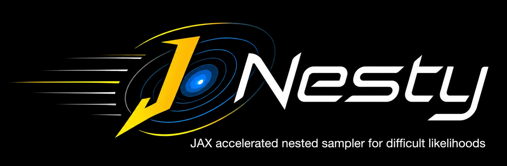

<p align="center">
  
</p>

# JNesty

GPU-accelerated nested sampling with JAX, designed for expensive likelihood
functions. JNesty parallelizes likelihood evaluations across GPU cores using
JAX's `vmap`, making it well-suited for problems where each likelihood call is
computationally costly (e.g., forward models, simulations, large-data
inferences).

## Features

- **JAX GPU acceleration** — likelihood evaluations are parallelized via
  `jax.vmap`, with automatic batch sizing based on GPU memory.
- **Dynesty-compatible API** — familiar `NestedSampler` interface; results
  include log-evidence, posterior samples, and importance weights.
- **Two sampling strategies** — uniform rejection sampling (fast early phase)
  followed by random walk proposals with adaptive scale tuning (Robbins-Monro).
- **Multi-ellipsoid bounds** — recursive k-means splitting with BIC selection,
  matching dynesty's `bound='multi'` implementation.
- **Queue mode** — dynesty-style GPU parallelism where each candidate gets a
  full random walk and scale adapts at queue drain.
- **Dynesty result interop** — convert results to dynesty's `Results` object
  for use with its plotting utilities.

## Installation

```bash
pip install -e .
```

Requires JAX with GPU support (`jax[cuda12]` or similar).

## Documentation

Build the docs locally:

```bash
pip install sphinx myst-parser sphinx-rtd-theme
cd doc && sphinx-build -b html . _build/html
```

Then open `doc/_build/html/index.html` in your browser.

**Online documentation:** https://jyshangguan.github.io/jnesty/

## Quick Example

```python
import jax.numpy as jnp
from jnesty import NestedSampler, plotting

# Define the problem: 5D correlated Gaussian
def loglikelihood(x):
    return -0.5 * jnp.sum(x**2)

def prior_transform(u):
    return 20.0 * u - 10.0  # uniform [-10, 10] in each dimension

# Run nested sampling
sampler = NestedSampler(loglikelihood, prior_transform, ndim=5)
sampler.run_nested(max_iterations=50000, delta_logZ_threshold=0.01)

# Access results
r = sampler.results
print(f"logZ = {r['logz']:.4f} +/- {r['logzerr']:.4f}")
print(f"H    = {r['information']:.4f}")
print(f"Converged: {r['converged']}")

# Built-in plots (no dynesty dependency)
fig, axes = plotting.runplot(r)
fig, axes = plotting.traceplot(r)
fig, axes = plotting.cornerplot(r)
```

### Multi-modal problem with multi-ellipsoid bounds

```python
sampler = NestedSampler(
    loglikelihood,
    prior_transform,
    ndim=5,
    nlive=1000,
    bound='multi',           # multi-ellipsoid decomposition
    # queue_size=8 is auto-enabled for bound='multi'
    # bound_update_interval=rwalk_K*nlive calls (auto)
)
sampler.run_nested()
```

### Saving and loading results

```python
from jnesty import save_results, load_results

save_results(sampler.results, 'output.fits')
loaded = load_results('output.fits')
print(f"Loaded logZ = {loaded['logz']:.4f}")
```

### Using dynesty's plotting

```python
sampler.plot_run()
sampler.plot_trace()
sampler.plot_corner()
```

## How It Works

JNesty follows dynesty's separation of concerns: a **bounding method**
defines the proposal region and an **internal sampler** generates candidate
points within that region.

**Sampling strategies** (internal samplers):

| Strategy | Description |
|----------|-------------|
| Uniform rejection | Draw random points from the unit cube; accept the first one above the likelihood threshold. Used automatically in the early phase when efficiency is high. |
| Random walk (`rwalk`) | N-ball proposals with adaptive scale via Robbins-Monro tuning. Matches dynesty's `sample='rwalk'`. |

**Bounding methods**:

| Bound | Description |
|-------|-------------|
| `none` | No bounding — proposals use the full unit cube (default). |
| `single` | Single ellipsoid fitted to live points. |
| `multi` | Multi-ellipsoid decomposition via recursive k-means splitting with BIC criterion. Periodic refitting measured in likelihood calls. |

The sampler runs in two phases:

1. **Phase 1** — Uniform rejection sampling. Fast when the prior volume is
   large relative to the posterior. Automatically switches to Phase 2 when
   sampling efficiency drops below a threshold.
2. **Phase 2** — Random walk with the chosen bounding method and adaptive
   scale tuning. Converges when the remaining evidence estimate
   `delta_logZ` falls below the threshold.

For expensive likelihoods, both phases parallelize evaluations across GPU
cores. The random walk phase supports two GPU parallelism modes:
**batch mode** (split `rwalk_K` steps across multiple independent walks) and
**queue mode** (dynesty-style batch queue where each candidate gets full
`rwalk_K` steps).

## More Examples

The `dev/demo/` folder contains complete comparison scripts against dynesty:

| Demo | Problem | Highlights |
|------|---------|------------|
| `01_multimodal_gaussian_mixture` | 5D bimodal Gaussian | Multi-ellipsoid bound, mode detection |
| `02_rosenbrock_banana` | 2D Rosenbrock | Non-Gaussian correlated posterior |
| `03_highd_gaussian` | 20D Gaussian | GPU scaling at high dimensions |
| `04_gaussian_shells` | 2D Gaussian shells | Thin degenerate ring structures |

Each demo has a JNesty variant (`*_jnesty.py`) and a dynesty variant
(`*_dynesty.py`) for direct comparison.

## Acknowledgments

JNesty's sampling algorithms and bounding methods closely follow the [dynesty](https://github.com/joshspeagle/dynesty) nested sampling package. We are also inspired by [JAXNS](https://github.com/Joshuaalbert/jaxns) to use JAX to accelerate nested sampling on GPU. This package was developed with [Claude Code](https://claude.com/claude-code), powered by the [GLM](https://bigmodel.cn/) 5.1 model.

## License

MIT
